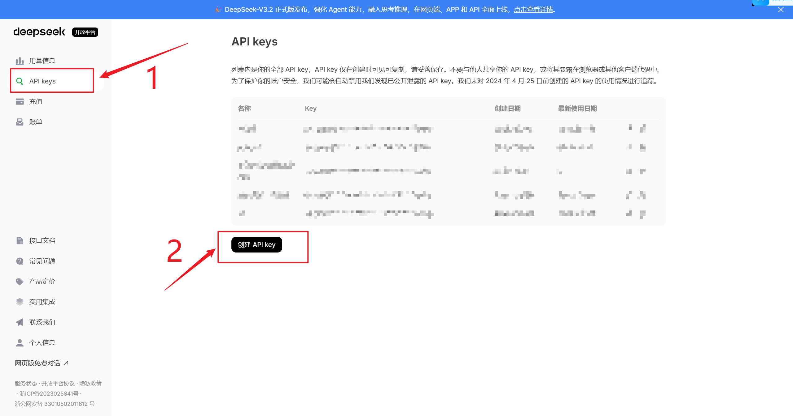
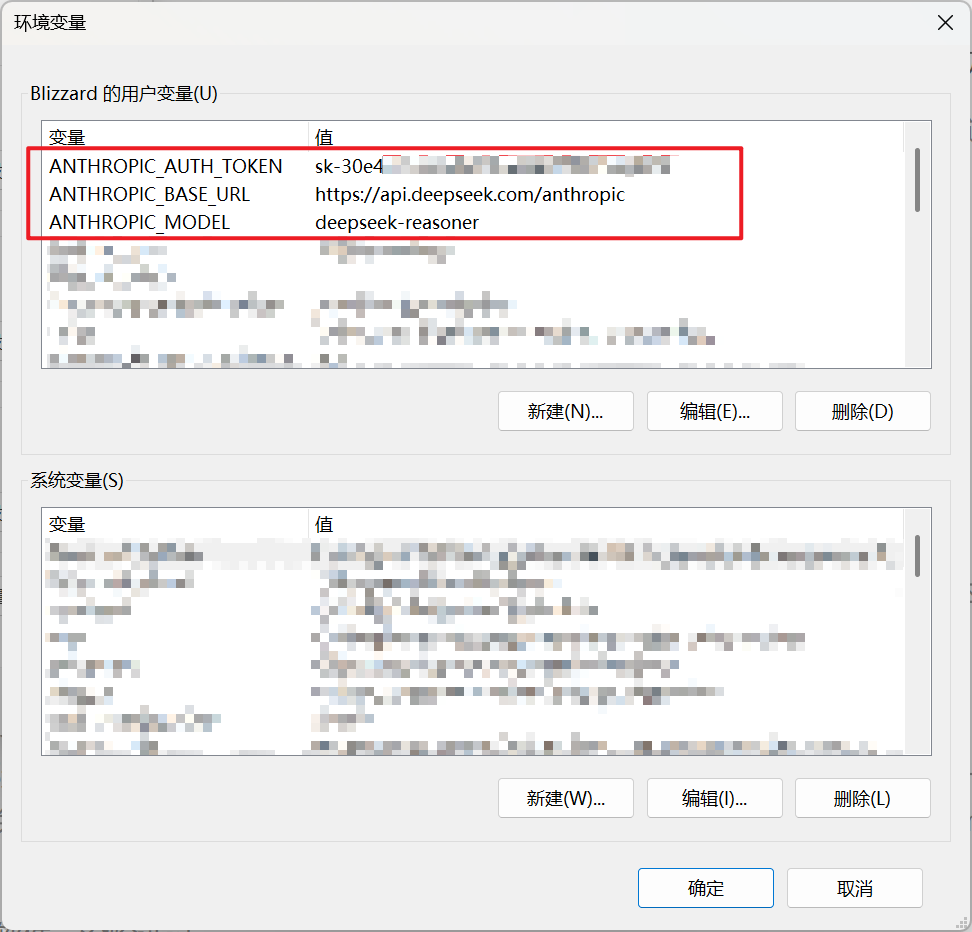
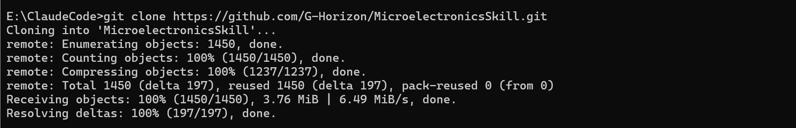
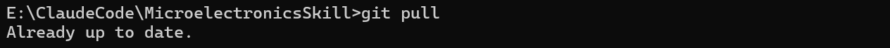
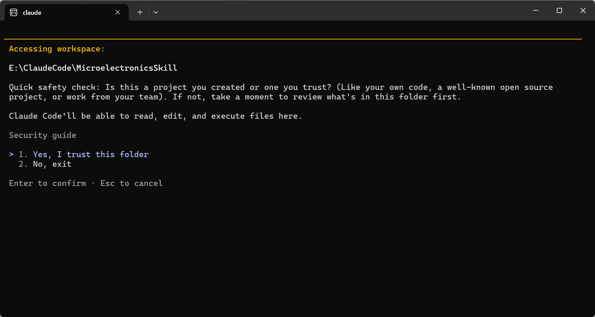
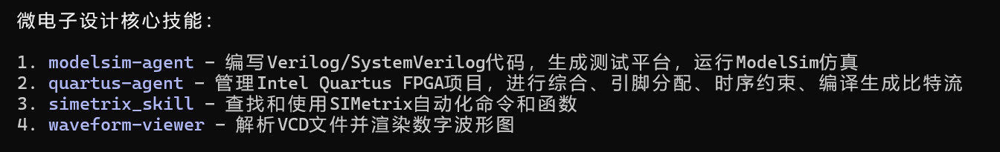

## 准备工作：

### 环境准备

1. 安装**git**，**nodejs**，**claude code**，python，配置好环境变量，能在命令行窗口里直接访问、并且不报错即可。

> claude code安装命令（powershell）：`irm https://claude.ai/install.ps1 | iex`

> 为了避免随着时间推移，C盘被python慢慢占满的问题，可以使用miniconda或者anaconda创建一个虚拟环境，让整个程序运行在虚拟环境里，方便管理。这里miniconda足够了。

> **验证方法**：按下Win+R，输入cmd，回车，分别尝试“git”，“node”，“claude”，“python”这几个命令，如果能正确显示出来、而不是显示“×××不是内部或外部命令，也不是可运行的程序或批处理文件”即可。

> 如果没有claude会员，这里提供一种基于deepseek的替代方案：
>
> 在deepseek官网的API开放平台注册一个key：访问https://platform.deepseek.com/usage，注册、登录、充值、创建API Key：
>
> 
>
> （务必记住Key，因为它只显示一次）
>
> 在环境变量中添加以下三个变量：
>
> **ANTHROPIC_AUTH_TOKEN**：sk-.....（填入key）
>
> **ANTHROPIC_BASE_URL**：https://api.deepseek.com/anthropic
>
> **ANTHROPIC_MODEL**：deepseek-reasoner
>
> （如果使用其他URL，注意：URL末尾没有“v3"/"v1"！！因为这是anthropic协议，而非更为常见的openai协议）
>
> 配置好的结果如图所示：
>
> 

2. 安装好modelsim、quartus、simetrix并配置好环境变量。

> 验证方法：按下Win+R，输入cmd，回车，分别尝试“modelsim”，“simetrix”这几个命令，如果能正确显示出一些东西、而不是显示“×××不是内部或外部命令，也不是可运行的程序或批处理文件”即可。

> 如果显示“不是内部或外部命令，也不是可运行的程序或批处理文件”，那么，需要将目录添加到环境变量里：
>
> 1. 返回桌面
> 2. 右键单击软件图标
> 3. “跳转到文件所在位置”
> 4. 把其所在文件夹的地址复制下来
> 5. 打开环境变量
> 6. 系统变量
> 7. Path项
> 8. 双击
> 9. 新建
> 10. 粘贴进去
> 11. 确定确定确定

> 注意，modelsim的版本为Modelsim SE-64 10.4；quartus的版本为Quartus (Quartus Prime 18.0) Standard Edition；simetrix和simplis是绑定在一块的，他们有各自的专精的领域，但是他们两个操控的底层语言是不一样的，官方文档里只有simetrix的命令讲解，为了避免冲突，此处只使用simetrix的相关命令，放弃一切simplis相关的关键字；simetrix这里用的版本是：SIMetrix-SIMPLIS 8.20。
>
> 不同版本的软件，没验证过。
>
> quartus没验证过，不保证百分百能跑通。

### 使用git命令下载相关skills并且维持更新

#### 首次使用：

1. 在D盘新建一个文件夹，名为ClaudeCode，进入，点击上方地址栏输入cmd并按下回车；
2. 输入下方命令，克隆开发者的仓库：

```Bash
git clone https://github.com/G-Horizon/MicroelectronicsSkill.git
```

此时目录下会多出一个MicroelectronicsSkill文件夹，如图所示，所有项目呈现“done”状态，即下载完毕。



#### 后续更新

1. 打开ClaudeCode/MicroelectronicsSkill文件夹
2. 点击上方地址栏输入cmd按下回车打开命令行窗口，输入下面的更新指令并按Enter执行：

```Bash
git pull
```



3. 如图所示完成更新。

## 使用方法

1. 打开ClaudeCode/MicroelectronicsSkill目录，点击上方地址栏，输入claude并按回车，打开claude code。



2. 按下回车，“Yes, I trust this folder"。 
3. 如果不确定skills是否成功加载，可以输入“？“按下回车发送，如果看到下面类似的描述，就对了：




> 因为目前prompt并未优化至最佳状态，所以最好能指定它调用哪个skill。

> 目前这几个skill能在本地跑通，暂未在虚拟机上验证，代码里可能出现绝对地址，进而报错，后续会补充的。